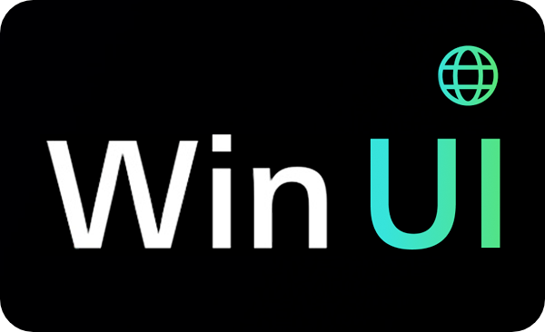
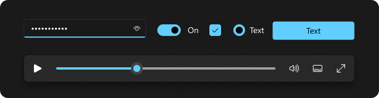

<p align="center"> 
  
</p>
<h1 align="center">windows-ui</h1>

<p align="center">Build Windows Fluent UI apps using <b>Html</b>, <b>CSS</b> & <b>JavaScript</b>.</p>
<p align="center"><a href="https://windows-ui.github.io/" target="_blank">Explore Project Docs »</a></p>

<meta name='keywords' content='Windows 10,Windows 11, FluentUI, html, css, js'>
<meta name='description' content='Build Windows Fluent UI apps using html, css & js'>
<meta name='author' content='Vivek Verma'>

<p align="center"></p>


# 🚧 Work in progress.

# Status
<a href="https://github.com/virtualvivek/windows-ui/tree/main/dist/windows-ui-11.min.css">
  
</a>
<a href="https://github.com/virtualvivek/windows-ui/tree/main/dist/windows-ui.min.js">
  
</a>
<a href="https://github.com/windows-ui/icons/tree/main/dist/" target="_blank">
  
</a>
<a href="https://github.com/windows-ui/icons/tree/main/dist/" target="_blank">
  
</a>
<a href="https://github.com/virtualvivek/react-windows-ui/blob/main/LICENSE">
  
</a>
<a href="https://github.com/virtualvivek/react-windows-ui/blob/main/LICENSE">
  
</a>
<a href="https://github.com/virtualvivek/react-windows-ui/blob/main/LICENSE">
  
</a>


<h1>Getting Started</h1>

Start a new project with the [boilerplate](https://github.com/virtualvivek/windows-ui/tree/master/boilerplate).

# Imports
When you need to include project's compiled `CSS` or `JS` files,
you can either use a local copies or use [jsDelivr](https://www.jsdelivr.com/).

```html
<!-- CSS minified -->
<link href="https://cdn.jsdelivr.net/npm/windows-ui@4.0.0/dist/config/app-config.css.css" rel="stylesheet" crossorigin="anonymous">
<link href="https://cdn.jsdelivr.net/npm/windows-ui@4.0.0/dist/windows-ui-11.min.css" rel="stylesheet" crossorigin="anonymous">
<link href="https://cdn.jsdelivr.net/npm/windows-ui@4.0.0/dist/icons/fonts/fonts.min.css" rel="stylesheet" crossorigin="anonymous">
```
```html
<!-- JavaScript minified -->
<script
  src="https://cdn.jsdelivr.net/npm/windows-ui@4.0.0/dist/windows-ui.bundle.min.js"
  crossorigin="anonymous">
</script>
```

# Configuration

**app-config.css** file contains the **`PrimaryColor`**, **`Fontfamily`** used by the app.<br/>
Make sure to add this file before **windows-ui.min.css**.<br/><br/>
By `default` project uses <a href="dist/config/app-config.css">app-config.css</a>.<br>

Customize by `creating` your own **app-config.css** file with any PrimaryColor/Fontfamily like this below:

  
```css
:root {
  --PrimaryColor: #0078D7; /* Change of your choice */
  --PrimaryColorLight: #47aeff;  /* Lighter version of --PrimaryColor for DarkMode */
}
body {
  font-family: "Segoe UI";
}
::selection {
  color: #ffffff;
  background-color: var(--PrimaryColor);
}
```


# Find this project useful? :heart:
Support it by joining [**stargazers**](https://github.com/virtualvivek/windows-ui/stargazers) for this repository. :star:

# Branches

<table>
  <tr align="left">
    <th><a href="https://github.com/virtualvivek/windows-ui">windows-ui<a/></th>
    <th>‣ Current</th>
  </tr>
  <tr>
    <th><a href="https://github.com/virtualvivek/windows-ui/tree/Windows10-framework">Windows10-framework<a/></th>
    <th>Legacy</th>
  </tr>
</table>


# License

`Windows-ui` is licensed under [MIT License](https://github.com/virtualvivek/windows-ui/blob/master/LICENSE) ‣ 
Copyright (c) [**virtualvivek**](https://github.com/virtualvivek).
