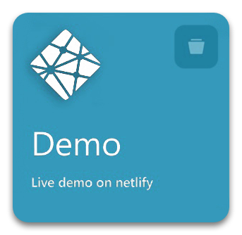
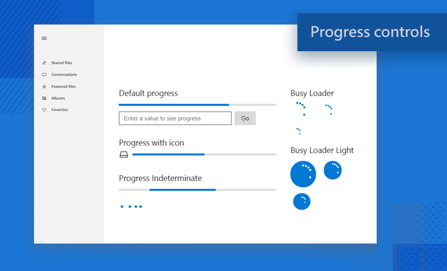
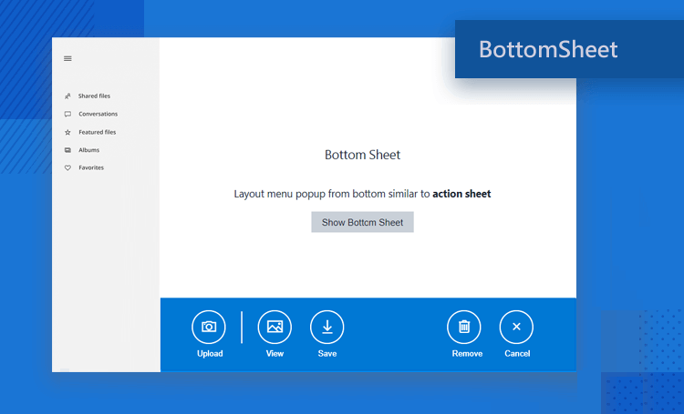
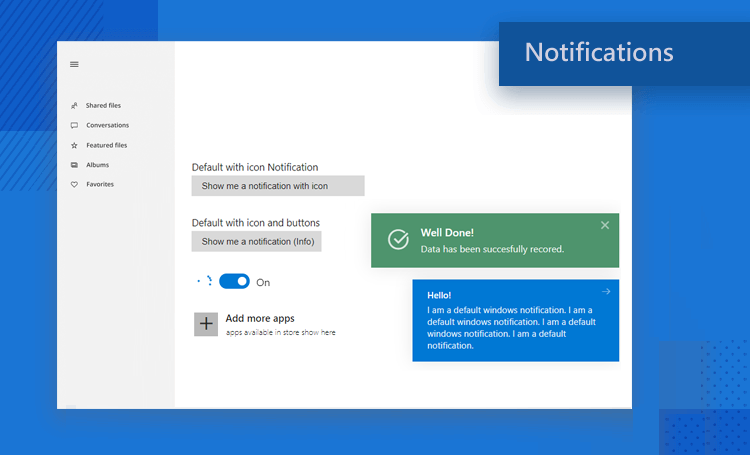

<h2 align="center"> 

   

</h2>


<meta name='keywords' content='Windows10,MetroUI,framework,html,css,js'>
<meta name='description' content='Build Windows 10 look and feel web apps or electron apps using html,css & js'>
<meta name='author' content='Vivek Verma'>


<p align="center">

  

	
  <a href="https://github.com/virtualvivek/Windows10-framework/blob/master/LICENSE">
    
  </a>
  

  <a href="https://github.com/virtualvivek/Windows10-framework/releases/latest">
    
  </a>
  
  <a href="https://windows10framework.netlify.app">
    
  </a>
   
</p>

<h2 align="center">Build Windows Apps with Convinience</h2>

<h3 align="center"><a href="https://windows10framework.github.io/">windows10framework.github.io</a></h3>

<p align="center">
	Build full featured Windows 10 Native apps or Web apps using <b>Html</b>, <b>CSS</b> & <b>JavaScript</b>. Comes with rich native like components, icon sets. Used as fast prototyping tool for Windows environment platforms. <br>	
</p>

	

<h2 align="center">
  <a href="https://windows10framework.netlify.app/"></a>

  

  
</h2>


## Stunning Set Of UI Elements

<h1 align="center">
	
	
</h1>
<p align="center">
Provides you with the rich UI Components that to completely matches the latest Windows environment that accelerates your productivity to build your hybrid windows app.
</p>
<br>

## Build Universal Windows or Web Apps
Create apps that run fluently on every device

<h1 align="center">
	
</h1>

# Documentation

  * [Form Elements](src/core/_docs/forms/README.md)
  * [Progress Controls](src/core/_docs/progressControls/README.md)
  * [Icons](src/core/_docs/icons/README.md)
  * [Bottom Sheet](src/core/_docs/bottomSheet/README.md)
  * [Alerts](src/core/_docs/alerts/README.md)
  * [Notifications](src/core/_docs/notifications/README.md)
  

<p align="center">
<a href="src/core/_docs/forms/README.md"></a>
<a href="src/core/_docs/progressControls/README.md"></a>
<a href="src/core/_docs/icons/README.md"></a>
<a href="src/core/_docs/bottomSheet/README.md"></a>
<a href="src/core/_docs/alerts/README.md"></a>
<a href="src/core/_docs/notifications/README.md"></a>
</p>

<br>
<h1>Getting Started</h1>

### Code container template
<h3>View <a href="templates/screen-main.html">App template</a></h3> 

```htm
framework/
└── src/
    └── core
    	├── config/
    	│   ├── css/
	│   ├── └── appConfig.css
    	│   ├── drawable/
	│   ├── └── ic_launcher.png
    	│   └── appConfig.js
    	├── css/
	│   └── windows10framework.css
    	└── js/
	├── windows10framework.js
	├── windows10framework.api.js
	└── windows10framework.notifications.js
```
<br>


### Configure App Preferences
Customize app `preferences` including `drop shadows`,`dark mode` etc.. using `appConfig.js` file <br>
<b>./src /core /config /<a href="src/core/config/appConfig.js">appConfig.js </a></b>


```js
let BlurEnabled = true;  //'true' get drop shadows for components
let ShowDarkModeSwitch = true;  //'true' get display a switch for dark/light mode
let NightMode = false;  //'true' get dark mode when app mounted
let FollowSystemTheme = true;  //'true' follow theme dark, light using system 
```
<br>

### Configure App Color, Font Family or ScrollBars
You can customize entire app `accent color`, `font family`, more using `appConfig.css` file <br>
<b>./src /core /config /css /<a href="src/core/config/css/appConfig.css">appConfig.css</a></b>


```css
:root {	
    --AppColor: #2D7D9A; 
    } /*Customize Entire App Color You Like*/

body {
    font-family: Segoe UI, sans-serif;  
    .... } /*Customize with your own font family*/
```

<br>

## Find this framework useful? :heart:
Support it by joining [stargazers](https://github.com/virtualvivek/Windows10-framework/stargazers) for this repository. :star:

<br>

## License

`Windows10-framework` is licensed under `MIT license`. View [license](https://github.com/virtualvivek/Windows10-framework/blob/master/LICENSE).<br>
Copyright (c) 2020-21 ` Vivek Verma `
