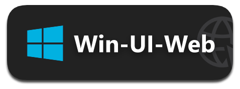
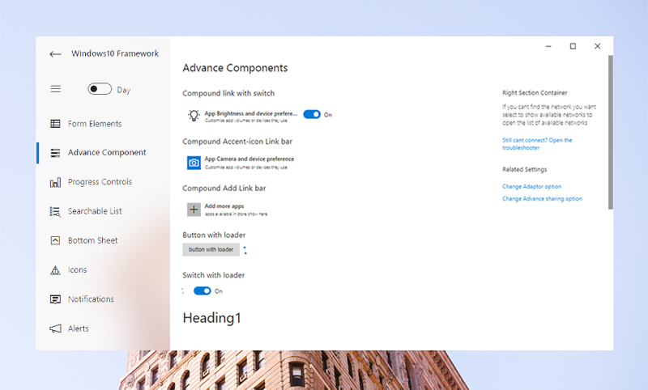

<p align="center"> 
   
</p>
<h1 align="center">windows-ui-web</h1>

<meta name='keywords' content='Windows10, MetroUI, framework,html,css,js'>
<meta name='description' content='Build Windows 10 look and feel web apps or electron apps using html,css & js'>
<meta name='author' content='Vivek Verma'>

<p align="center">

  
	
  <a href="https://github.com/virtualvivek/Windows10-framework/blob/master/LICENSE">
    
  </a>

  <a href="https://github.com/virtualvivek/Windows10-framework/releases/latest">
    
  </a>
  
  <a href="https://windows10framework.netlify.app">
    
  </a>
   
</p>


<p align="center">
Build full featured Windows 10 Native apps or Web apps using <b>Html</b>, <b>CSS</b> & <b>JavaScript</b>.
</p>

	
# Demo ⚡
https://windows10framework.netlify.app/


## Stunning Set Of UI Elements

<p align="center">
  
  
</p>
<p>
Provides you with the rich UI Components that to completely matches the latest Windows environment that accelerates your productivity to build your hybrid windows app.
</p>

## Build Universal Windows or Web Apps
Create apps that run fluently on every device

<h1 align="center">
	
</h1>

# Documentation

  * [Form Elements](src/core/_docs/forms/README.md)
  * [Progress Controls](src/core/_docs/progressControls/README.md)
  * [Icons](src/core/_docs/icons/README.md)
  * [Bottom Sheet](src/core/_docs/bottomSheet/README.md)
  * [Alerts](src/core/_docs/alerts/README.md)
  * [Notifications](src/core/_docs/notifications/README.md)


<h1>Getting Started</h1>

### Code container template
<h3>View <a href="templates/screen-main.html">App Boilerplate</a></h3> 

```htm

./src
 └ core
   ├─ config/
   │  ├─ css/
   │  ├─ └─ appConfig.css
   │  ├─ drawable/
   │  ├─ └─ ic_launcher.png
   │  └─ appConfig.js
   ├─ css/
   │  └─ windows10framework.css
   └─ js/
      ├─ windows10framework.js
      ├─ windows10framework.api.js
      └─ windows10framework.notifications.js
```


## Configure App Preferences
‣ Customize app `preferences` including `drop shadows`,`dark mode` etc.. using `appConfig.js` file <br>
<b>./src/core/config/<a href="src/core/config/appConfig.js">appConfig.js </a></b>


```js
let BlurEnabled = true;  	//'true' get drop shadows for components
let ShowDarkModeSwitch = true;  //'true' get display a switch for dark/light mode
let NightMode = false;  	//'true' get dark mode when app mounted
let FollowSystemTheme = true;  	//'true' follow theme dark, light using system 
```

## Configure App Color, Font Family or ScrollBars
‣ `appConfig.css` file contains the app `PrimaryColor`, `Fontfamily` used by the app <br>
<b>./src/core/config/css/<a href="src/core/config/css/appConfig.css">appConfig.css</a></b>


```css
:root {
    --PrimaryColor: #6632a8;  /* Change color you like */ 
}
body {
    font-family: "Segoe UI";  /* Change fontfamily you like */
}
```


# Find this framework useful? :heart:
Support it by joining [**stargazers**](https://github.com/virtualvivek/Windows10-framework/stargazers) for this repository. :star:

# License

`Windows10-framework` is licensed under `MIT license`. View [license](https://github.com/virtualvivek/Windows10-framework/blob/master/LICENSE).<br>
Copyright (c) 2020-21 [**Vivek Verma**](https://github.com/virtualvivek)
