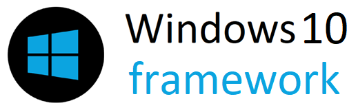
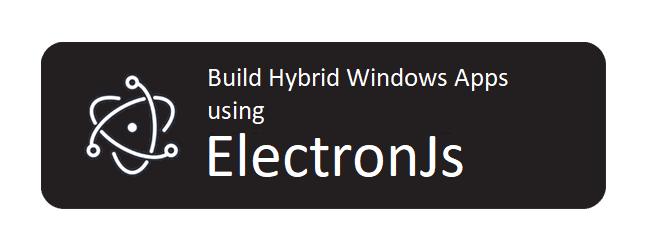
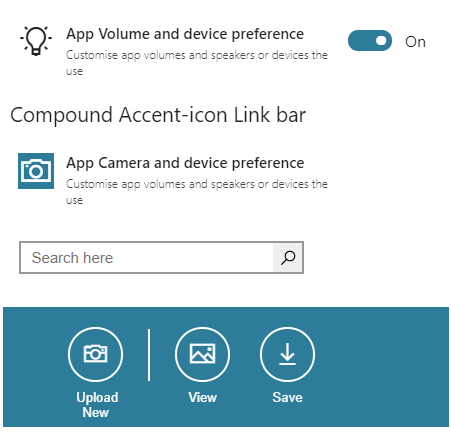

<h2 align="center"> 
   
</h2>

<meta name='keywords' content='Windows10,MetroUI,framework,html,css,js'>
<meta name='description' content='Build Windows 10 look and feel web apps or electron apps using html,css & js'>
<meta name='author' content='Vivek Verma'>
  
<p align="center">

  
	
  <a href="https://github.com/virtualvivek/Windows10&#95;framework/blob/master/LICENSE">
    
  </a>
  
  <a href="https://github.com/virtualvivek/Windows10&#95;framework">
    
  </a>
</p>

<h2 align="center">Build Apps with Convinience</h2>
<p align="center">
	Build your Windows apps with just web skills using <b>HTML</b>, <b>CSS</b> and <b>JavaScript</b>, Develop apps for Windows Platform compatible using ElectronJs framework and publish it on Windows App Store on the go!. <br>	
</p>


<h2 align="center">

<a href="https://windows10-framework.netlify.app/"></a>




</h2>


## Stunning Set Of UI Elements


<p>
Provides you with the rich UI Components that to completely matches the latest Windows environment that accelerates your productivity to build your hybrid windows app.
<br>
</p>
<h1>Clean, Native Container with Navigation</h1>


<br>
<br><br><br>

<p>
<br><br>
<br><br><br>
</p>
<h1>Finest Form Elements <br>for your apps</h1>


<br><br>
<br><br><br>
<br><br><br><br>

<p>
<br><br>
</p>

<h1>Splash Screens Dark Accent and Light Accent </h1>


<br><br>
<br><br>
<br><br><br>

<p>
<br><br>	
<br><br><br>
</p>
<h1>Custom Hybrid <br>Elements</h1>


<br>
<br><br>
<br><br><br>
<h1>Getting Started</h1>

### Code container template
<h3>View <a href="templates/screen-main.html">Complete mainframe template</a></h3> 

```htm

<body>			
  <div class="app-container">
	
    	<div class="app-tabs"> 
        	<div id="app-wrapper">           
     		   <nav class="animate">       
        	     <!-- Your App Name--> 
        	      <span id="app-name">Windows10 Framework</span>
        		<ul>
			  <a href="#" class="app-nav-toggler" id="menu-toggle"></a><br>
			  <!-- Navigation items--> 
                          <li><a href="#app-section-1" class="nav-icon icon-1"><span>Tab 1</span></a></li>
			  <li><a href="#app-section-2" class="nav-icon icon-2"><span>Tab 2</span></a></li>
			  <li><a href="#app-section-3" class="nav-icon icon-3"><span>Tab 3</span></a></li>
		          <li><a href="#app-section-4" class="nav-icon icon-4"><span>Tab 4</span></a></li>
			</ul>
        	   </nav>
       		</div>
		
    	 <div class="app-content-wrap">					
     		<section id="app-section-1">      
        		<div class="app-section-container">
			......
			<Your Content>
			......
			</div>
		</section>
		..........
		<section id="app-section-4">      
        		<div class="app-section-container">
			......
			<Your Content>
			......
			</div>
		</section>
	</div>
      </div>
   </div>
</body>

```

### Configure App Color
You can customize entire app color including all components using `accentColor.css` file
#### ./ app-config / css / accentColor.css

```css
	:root {
	    --AppColor: #2D7D9A;  /*Customize with your own color*/
	    --alpha_c : #eee;
	}

```


### Configure App Font Family / Weight or ScrollBars
You can customize entire app font family and font weight or scrollbars using `accentConfig.css` file
#### ./ app-config / css / accentConfig.css

```css
	body {
	    font-weight: 400;
	    font-family: Segoe UI, sans-serif;  /*Customize with your own font family*/
	    .... }
	  
	*::-webkit-scrollbar,
	*::-webkit-scrollbar-thumb {
	  .... }

```


### Libraries require:

<a href="https://jquery.com">jQuery - jquery.com</a> <br>
<a href="https://github.com/icons8/windows-10-icons">icons8/windows-10-icons</a>


## License

	MIT License

	Copyright (c) 2020 Vivek Verma

	Permission is hereby granted, free of charge, to any person obtaining a copy
	of this software and associated documentation files (the "Software"), to deal
	in the Software without restriction, including without limitation the rights
	to use, copy, modify, merge, publish, distribute, sublicense, and/or sell
	copies of the Software, and to permit persons to whom the Software is
	furnished to do so, subject to the following conditions:

	The above copyright notice and this permission notice shall be included in all
	copies or substantial portions of the Software.

	THE SOFTWARE IS PROVIDED "AS IS", WITHOUT WARRANTY OF ANY KIND, EXPRESS OR
	IMPLIED, INCLUDING BUT NOT LIMITED TO THE WARRANTIES OF MERCHANTABILITY,
	FITNESS FOR A PARTICULAR PURPOSE AND NONINFRINGEMENT. IN NO EVENT SHALL THE
	AUTHORS OR COPYRIGHT HOLDERS BE LIABLE FOR ANY CLAIM, DAMAGES OR OTHER
	LIABILITY, WHETHER IN AN ACTION OF CONTRACT, TORT OR OTHERWISE, ARISING FROM,
	OUT OF OR IN CONNECTION WITH THE SOFTWARE OR THE USE OR OTHER DEALINGS IN THE
	SOFTWARE.
