# Forms

# Table of Contents

  * [Switch](#switch)
  * [Button](#button)
  * [Checkbox](#checkbox)
  * [Input Text](#input-text)
  * [Input Password](#input-password)
  * [Input Quantity](#input-quantity)
  * [Links](#links)
  * [Radio](#radio)
  * [Search](#search)
  * [Select](#select)
  * [SliderBar](#sliderbar)

---


# Switch
Switches are special checkboxes used for binary states such as on / off.

### Switch Default 


```html
<label class="app-switch">
    <input checked type="checkbox"/>
    <div data-off="Off" data-on="On"></div>
</label>
```
### Switch Disabled 
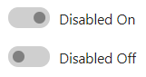

```html
<label class="app-switch">
    <input type="checkbox" checked disabled/>
    <div data-off="Disabled Off" data-on="Disabled On"></div>
</label>
```
---


# Button
Buttons used to submit forms or anywhere in a document for accessible, standard button functionality.

### Button Default 


```html
<input class="app-button" type="button" value="Default button" />
```

### Button Default Disabled 


```html
<input class="app-button" type="button" value="Disabled button" disabled/>
```
### Button Primary Default 
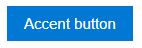

```html
<input class="app-button primary" type="button" value="Default button"/>
```

### Button Primary Disabled 
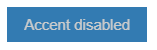

```html
<input class="app-button primary" type="button" value="Accent button" disabled/>
```
---


# CheckBox
The checkbox is shown as a square box that is ticked (checked) when activated.

### CheckBox Default 


```html
<label class="app-checkbox">
    <input type="checkbox" value="value" checked> Checked
</label>
```
### CheckBox Disabled 


```html
<label class="app-checkbox">
    <input type="checkbox" value="value" checked disabled> Checked
</label>
```
---


# Input Text
The input element, having the "text" value in its type attribute, represents a field for text input. The control associated to this field is a text box.

### InputText Default 
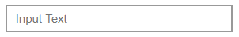

```html
<input class="app-input-text" type="text" placeholder="Input Text"/>
```
### InputText Disabled 
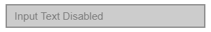

```html
<input class="app-input-text" type="text" placeholder="Input Text Disabled" disabled/>
```
---


# Input Password
The input element, having the "password" value in its type attribute, represents a field for password input. The control associated to this field is a password box.

### InputPassword Default 


```html
<input class="app-input-text app-input-password" type="password" placeholder="Input Password">
```
### InputPassword Disabled 


```html
<input class="app-input-text app-input-password" type="password" placeholder="Input Password Disabled" disabled>
```
---


# Input Quantity
Defines a field for entering a number. Use the following attributes to specify restrictions: max - specifies the maximum value allowed. min - specifies the minimum value allowed.

### InputQuantity Default 


```html
<div class="app-quantity">
    <input type="number" min="1" max="9" step="1" value="1">
</div>
```
### InputQuantity Disabled 


```html
<div class="app-quantity" disabled>
    <input type="number" min="1" max="9" step="1" value="1">
</div>
```
---


# Links
links are hyperlinks. You can click on a link and jump to another document.

### Compound Link


```html
<a href="#" class="app-link-compound">
    <i class="icons10-timeline"></i>
    <span>App Volume and device preference</span>
    <p>Customise app volumes or devices they use</p>
</a>
```
### Compound Link Primary


```html
<a href="#" class="app-link-compound primary">
    <i class="icons10-notification-image"></i>
    <span>App Notification and device preference</span>
    <p>Customise app volumes and speakers or devices they use</p>
</a>
```
### Compound Link BG Primary
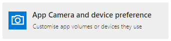

```html
<a href="#" class="app-link-compound">
   <i class="icons10-camera bg-primary"></i>
   <span>App Camera and device preference</span>
   <p>Customise app volumes or devices they use</p>
</a>
```
### Compound Link BG Grey


```html
<a href="#" class="app-link-compound">
    <i class="icons10-plus bg-grey"></i>
    <span>Add more apps</span>
    <p>apps available in store show here</p>
</a>
```
---


# Radio
Radio buttons are normally presented in radio groups (a collection of radio buttons describing a set of related options). Only one radio button in a group can be selected at the same time.

### Radio Default 


```html
<label class="app-label">
  <input type="radio" name="1" class="app-radio"  checked/> Checked
</label>
```
### Radio Disabled 
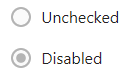

```html
<label class="app-label">
  <input type="radio" name="1" class="app-radio" checked disabled/> Checked
</label>
```
---


# Search
Search Input defines a text field for entering a search string.

### Search Bar
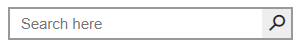

```html
<div class="app-search-bar"> 
    <input class="app-input-text app-input-search" type="search" placeholder="Search here"/>
    <button type="submit"></button>
</div>
```

### Search Box
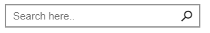

```html
<div class="app-search-box"> 
    <input class="app-input-text app-input-search" type="search" placeholder="Search here"/>
    <button type="submit"></button>
</div>
```

### Search Suggestions 
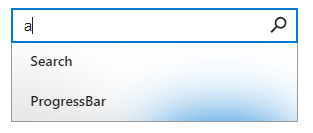

```html
<select class="app-search-box-auto" id="searchBarAuto">
    <option value="1">Search</option>
    <option value="2">Elements</option>
    <option value="3">ProgressBar</option>
    <option value="4">Theme</option>
</select>
```
---


# Select
The 'select' element is most often used in a form, to collect user input. The name attribute is needed to reference the form data after the form is submitted (if you omit the name attribute, no data from the drop-down list will be submitted).

### Select Default 


```html
<select class="app-select">
    <option selected>Choose an option</option>
    <option value="1">Java</option>
    <option value="2">Python</option>
    <option value="3">C++</option>
</select>
```
### Select Disabled 


```html
<select class="app-select" disabled>
    <option selected>Choose an option Disabled</option>
    <option value="1">Java</option>
    <option value="2">Python</option>
    <option value="3">C++</option>
</select>
```
---


# SliderBar
Defines a control for entering a number whose exact value is not important (like a slider control). Default range is 0 to 100. However, you can set restrictions on what numbers are accepted with the attributes below.

### SliderBar Default 
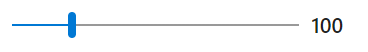

```html
<div class="app-range-slider">
    <input type="range" value="100" min="0" max="500">
    <span>100</span>
</div>
```
### SliderBar Round 
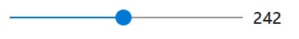

```html
<div class="app-range-slider round">
    <input type="range" value="242" min="0" max="500">
    <span>100</span>
</div>
```

### SliderBar Round-Border 
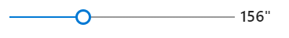

```html
<div class="app-range-slider round-border">
    <input type="range" value="156" min="0" max="500">
 <span>100</span><span>"</span>
</div>
```

---
