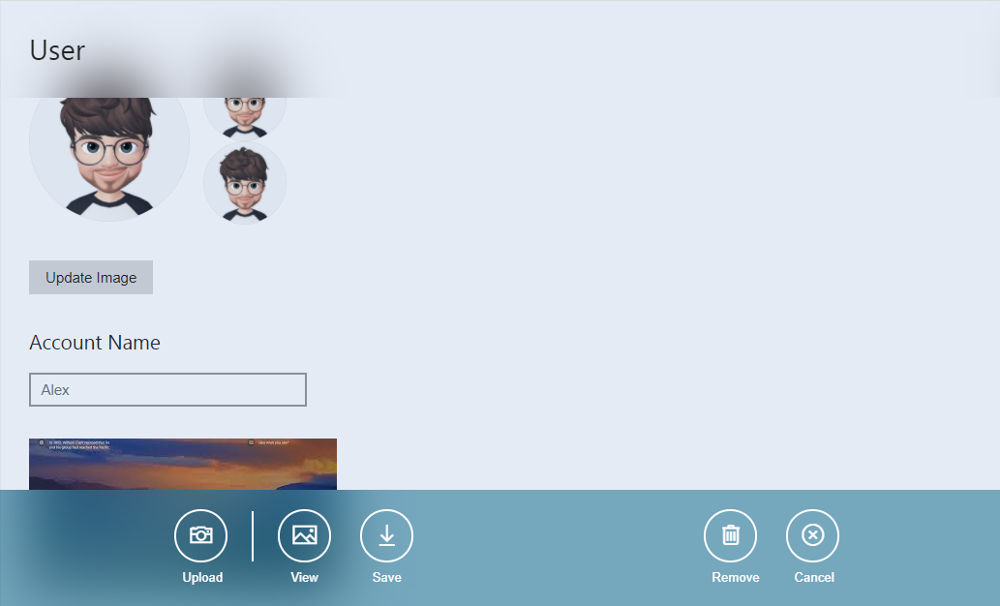

# BottomSheet


Bottom sheets are surfaces containing supplementary content that are anchored to the bottom of the screen.

<br>

<b>Note</b> ```yourTarget``` is the unique id use to access bottomSheet.

## Step 1. Defining structure

```html
 <div class="app-bottomsheet" id="yourTarget">
    <div>
       <button><i class="icons10-camera"></i><span>Upload</span></button>
       <hr/> <!-- use to show a hr line between -->
       <button><i class="icons10-picture"></i><span>View</span></button>
       <button><i class="icons10-download"></i><span>Save</span></button>               
       <bottomsheet-optionBar-space></bottomsheet-optionBar-space>  <!-- use to show space between -->
       <button><i class="icons10-trash"></i><span>Remove</span></button>
       <button class="app-bottomsheet-close"><i class="icons10-cross"></i><span>Cancel</span></button>  
          <!-- use to hide bottomsheet using class="app-bottomsheet-close" -->
    </div>
 </div>
```
## Step 2. Calling Bottomsheet

```html
 <input type="button" data-bottomsheet-target="yourTarget" class="app-bottomsheet-button" value="Show Bottom Sheet" />
```

## Result. 




