# Forms

# Index

  * [Switch](#switch)
  * [Button](#button)
  * [Checkbox](#checkbox)
  * [Input Text](#input-text)
  * [Input Password](#input-password)
  * [Input Quantity](#input-quantity)
  * [Links](#links)


# Switch
Switches are special checkboxes used for binary states such as on / off.

### Default Switch


```html
<label class="app-switch">
    <input checked type="checkbox"/>
    <div data-off="Off" data-on="On"></div>
</label>
```
### Disabled Switch


```html
<label class="app-switch">
    <input checked disabled type="checkbox"/>
    <div data-off="Disabled Off" data-on="Disabled On"></div>
</label>
```
---


# Button
Buttons used to submit forms or anywhere in a document for accessible, standard button functionality.

### Default Button
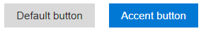

```html
<input type="button" value="Default button" />
```

### Default Disabled Button
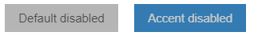

```html
<input type="button" value="Accent button" disabled/>
```
### Accent Default Button


```html
<input type="button" value="Default button" accent/>
```

### Accent Disabled Button


```html
<input type="button" value="Accent button" accent disabled/>
```
---


# CheckBox
The checkbox is shown as a square box that is ticked (checked) when activated.

### Default CheckBox


```html
<div class="app-checkbox">
   <input id="i2" type="checkbox" checked>
   <label for="i2">Checked</label>
</div>
```
### Disabled CheckBox
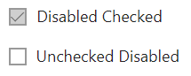

```html
<div class="app-checkbox">
   <input id="i4" type="checkbox" disabled checked>
   <label for="i4">Disabled Checked</label>
</div>
```
---


# Input Text
The input element, having the "text" value in its type attribute, represents a field for text input. The control associated to this field is a text box.

### Default InputText


```html
<input type="text" placeholder="Input Text"/>
```
### Disabled InputText


```html
<input type="text" placeholder="Input Text Disabled" disabled/>
```
---


# Input Password
The input element, having the "password" value in its type attribute, represents a field for password input. The control associated to this field is a password box.

### Default InputPassword
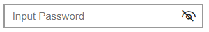

```html
<input class="app-password" type="password" placeholder="Input Password">
```
### Disabled InputPassword


```html
<input class="app-password" type="password" placeholder="Input Password Disabled" disabled>
```
---


# Input Quantity
Defines a field for entering a number. Use the following attributes to specify restrictions: max - specifies the maximum value allowed. min - specifies the minimum value allowed.

### Default InputQuantity
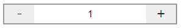

```html
<div class="app-quantity">
    <input type="number" min="1" max="9" step="1" value="1">
</div>
```
### Disabled InputQuantity
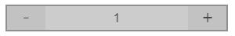

```html
<div class="app-quantity" disabled>
    <input type="number" min="1" max="9" step="1" value="1">
</div>
```
---


# Links
links are hyperlinks. You can click on a link and jump to another document.

### Compound Link
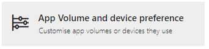

```html
<a href="#" class="app-link-compound">
    <div><i class="icons10-timeline"></i>
        <span>App Volume and device preference</span>
        <p>Customise app volumes or devices they use</p>
    </div>
</a>
```
### Compound Link Accent
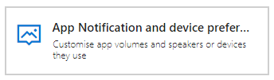

```html
<a href="#" class="app-link-compound-accent">
    <div><i class="icons10-notification-image"></i>
        <span>App Notification and device preference</span>
        <p>Customise app volumes and speakers or devices they use</p>
    </div>
</a>
```
### Compound Link BG Accent


```html
<a href="#" class="app-link-compound icon-bg-accent">
    <div><i class="icons10-camera"></i>
       <span>App Camera and device preference</span>
       <p>Customise app volumes or devices they use</p>
    </div>
</a>
```
### Compound Link BG Grey
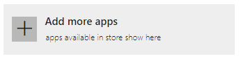

```html
<a href="#" class="app-link-compound icon-bg-grey">
    <div><i class="icons10-plus"></i>
       <span>Add more apps</span>
       <p>apps available in store show here</p>
    </div>
</a>
```
---


# Radio
Radio buttons are normally presented in radio groups (a collection of radio buttons describing a set of related options). Only one radio button in a group can be selected at the same time.

### Default Radio
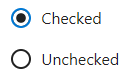

```html
<div class="app-radio">
    <input id="radio-1" name="radio" type="radio" checked>
    <label for="radio-1"><span>Checked</span></label>
</div>
```
### Disabled Radio


```html
<div class="app-radio">
    <input id="radio-3" name="radio" type="radio" disabled>
    <label for="radio-3"><span>Disabled</span></label>
</div>
```
---


# Search
Search Input defines a text field for entering a search string.

### Default Search


```html
<div class="app-searchBar"> 
    <input type="search" placeholder="Search here"/>
    <button type="submit"></button>
</div>
```
### Suggestions Search


```html
<select name="" class="app-searchBarAuto" id="searchBarAuto">
    <option value="1">Search</option>
    <option value="2">Elements</option>
    <option value="3">ProgressBar</option>
    <option value="4">Theme</option>
</select>
```
---


# Select
The 'select' element is most often used in a form, to collect user input. The name attribute is needed to reference the form data after the form is submitted (if you omit the name attribute, no data from the drop-down list will be submitted).

### Default Select


```html
<div class="app-select">
    <select>
        <option selected>Choose an option</option>
        <option value="1">Java</option>
        <option value="2">Python</option>
        <option value="3">C++</option>
    </select>
</div>
```
### Disabled Select


```html
<div class="app-select" disabled>
    <select>
        <option selected>Choose an option Disabled</option>
        <option value="1">Java</option>
        <option value="2">Python</option>
        <option value="3">C++</option>
    </select>
</div>
```
---


# SliderBar
Defines a control for entering a number whose exact value is not important (like a slider control). Default range is 0 to 100. However, you can set restrictions on what numbers are accepted with the attributes below.

### Default SliderBar


```html
<div class="app-range-slider">
    <input type="range" value="100" min="0" max="500">
    <span>100</span>
</div>
```
### Round SliderBar
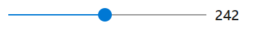

```html
<div class="app-range-slider round">
    <input type="range" value="242" min="0" max="500">
    <span>100</span>
</div>
```
### Classic SliderBar
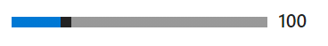

```html
<div class="app-range-slider classic">
    <input type="range" value="100" min="0" max="500">
    <span>100</span>
</div>
```
---


