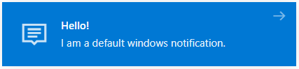
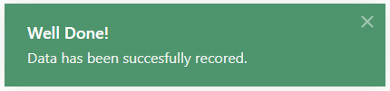

# Notifications

# Table of Contents

  * [Notification Default](#notification-default)
  * [Notification Default Icon](#notification-default-icon)
  * [Notification Success](#notification-success)
  * [Notification Warning](#notification-warning)
  * [Notification Danger](#notification-danger)

---


A notification is a message that your app provide the user with reminders, communication from other people, or other timely information from your app. Users can tap the notification to open your app or take an action directly from the notification. 

### Notification Default


### Step 1. Defining

```js
function CallNotificationDefault()
 {
    var options = getOptions();
    options.title = 'Hello!';
    options.description = 'I am a default windows notification.';
    options.width = 350;
    WinNotification.notify(options);
 }
```
### Step 2. Calling

```html
<input type="button" value="Show Notification" onclick="CallNotificationDefault()"/>
```
---


### Notification Default Icon


### Step 1. Defining

```js
function CallNotificationDefaultIcon()
 {
    var options = getOptions();
    options.title = 'Hello!';
    options.description = 'I am a default windows notification.';
    //options.image = 'img/default.png';
    options.image = {
        visible: true
    };
    WinNotification.notify(options);
 }
```
### Step 2. Calling

```html
<input type="button" value="Show Notification" onclick="CallNotificationDefaultIcon()"/>
```
---


### Notification Success


### Step 1. Defining

```js
function CallNotificationSuccess()
 {
    var options = getOptions();
    options.title = 'Well Done!';
    options.description = 'Data has been succesfully recored.';
    options.type = 'success';
    WinNotification.notify(options);
 }
```
### Step 2. Calling

```html
<input type="button" value="Show Notification" onclick="CallNotificationSuccess()"/>
```
---


### Notification Warning


### Step 1. Defining

```js
function CallNotificationWarning()
 {
    var options = getOptions();
    options.title = 'Reminder!';
    options.description = 'You have a meeting at 9:11 АМ';
    options.type = 'warning';
    WinNotification.notify(options);
 }
```
### Step 2. Calling

```html
<input type="button" value="Show Notification" onclick="CallNotificationWarning()"/>
```
---


### Notification Danger


### Step 1. Defining

```js
function CallNotificationDanger()
 {
    var options = getOptions();
    options.title = 'Warning!';
    options.description = 'The data presentation here can be change.';
    options.type = 'danger'; // or 'error'
    WinNotification.notify(options);
 }
```
### Step 2. Calling

```html
<input type="button" value="Show Notification" onclick="CallNotificationDanger()"/>
```
---


